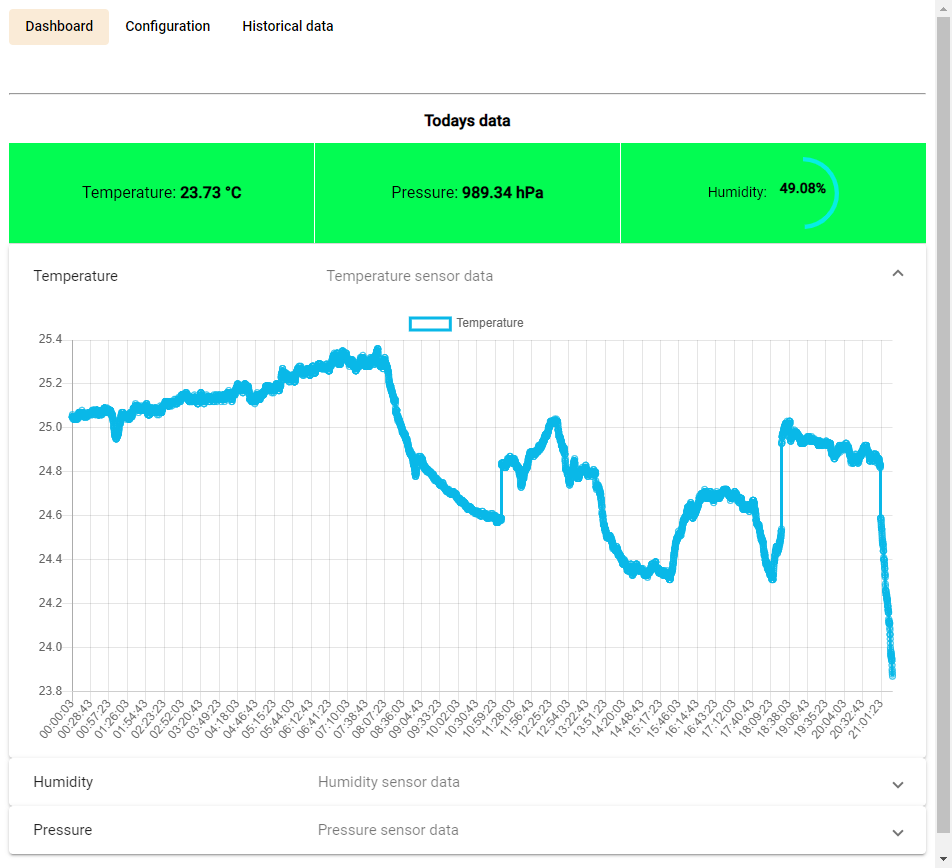
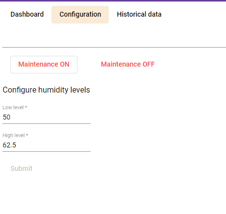
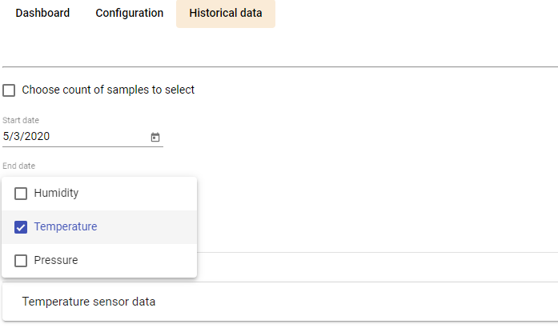

# home_climat_control
Simple project to manage and monitor home climat.
It is divided into 3 folders:
## 1. Arduino application
It is retrieving sensors data and sends it to raspberry pi host through COM Port. Also it can receive settings from it. Settings are related to humidifier, that is controlled by arduino. You can set humidity minimum and maximum humidity levels that should be provided in your home.
## 2. ASP.NET Core backend
It is receiving data from arduino and stores it to sqlite database. Also it has resource endpoints that could be used to retrieve sensor data and control arduino. Also it sends sensor data to client every N seconds using SignalR.
## 3. Angular 9 frontend
Using it you can see sensor data plots and configure humidity levels for yoru humidifier.

---
Screenshots of that project are presented below:
## Dashboard
Try to find out when was room ventilation 😀

## Configuration

## Historical data
